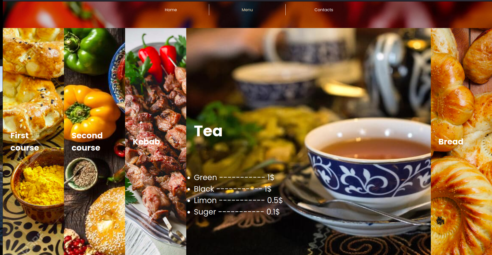

# Offical web page of the restaurant Uzbek National Kitchen

> All you need to know about Uzbek kitchen

This project is initiated and inspired within the curriculum of The Odin Project to demonstrate the usage of webpack and js modules

## Built With

- Major languages
 - Java Script
 - HTML/CSS
- Frameworks
 - N/A
- Technologies used
 - Webpack
 - SCSS

## Live Demo

[Live Demo Link](https://livedemo.com)

## Getting Started

**This is an example of how you may give instructions on setting up your project locally.**
**Modify this file to match your project, remove sections that don't apply. For example: delete the testing section if the currect project doesn't require testing.**

To get a local copy up and running follow these simple example steps.

### Prerequisites

### Setup

### Install

### Usage

### Run tests

### Deployment

## Authors

👤 ** Umidjon Ustabaev (Hope)**

- GitHub: [@hope1226](https://github.com/Hope1226)
- Twitter: [@twitterhandle](https://twitter.com/twitterhandle)
- LinkedIn: [LinkedIn](https://www.linkedin.com/in/umidjon-ustabaev-03b92b11a/)

## 🤝 Contributing

Contributions, issues, and feature requests are welcome!

Feel free to check the [issues page](../../issues/).

## Show your support

Give a ⭐️ if you like this project!

## Acknowledgments

- Hat tip to anyone whose code was used
- Inspiration
- etc

## 📝 License

This project is [MIT](./MIT.md) licensed.
